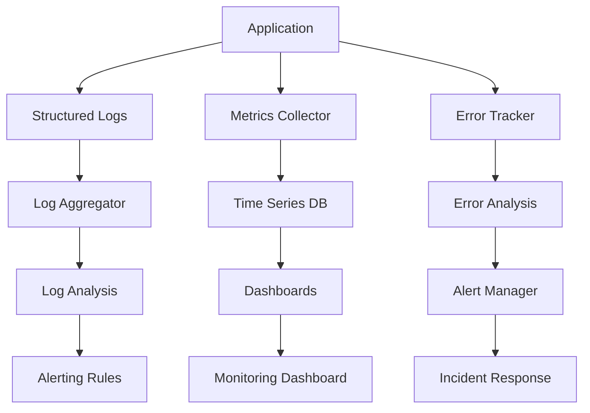

# Monitoring and Logging Guide: KGiQ Family Finance

## Table of Contents
1. [Overview](#overview)
2. [System Architecture](#system-architecture)
3. [Application Logging](#application-logging)
4. [Performance Monitoring](#performance-monitoring)
5. [Infrastructure Monitoring](#infrastructure-monitoring)
6. [Security Monitoring](#security-monitoring)
7. [Business Metrics](#business-metrics)
8. [Alerting and Notifications](#alerting-and-notifications)
9. [Log Management](#log-management)
10. [Dashboards and Visualization](#dashboards-and-visualization)
11. [Incident Response](#incident-response)
12. [Compliance and Audit](#compliance-and-audit)

## Overview

This guide establishes comprehensive monitoring and logging strategies for the KGiQ Family Finance application to ensure system reliability, security, and performance.

### Monitoring Objectives
- **Availability**: 99.9% uptime target
- **Performance**: <200ms API response time (p95)
- **Error Rate**: <0.1% application errors
- **Security**: Real-time threat detection and prevention
- **Business**: Track user engagement and feature adoption

### Monitoring Stack
- **Application**: Custom logging with structured JSON
- **Infrastructure**: Prometheus + Grafana
- **Error Tracking**: Sentry
- **Performance**: Web Vitals + Custom metrics
- **Security**: Custom security event logging
- **Business**: Custom analytics events

## System Architecture

### Monitoring Flow


### Data Flow Architecture
```typescript
// monitoring-architecture.ts
interface MonitoringPipeline {
  collection: {
    applicationLogs: LogCollector;
    systemMetrics: MetricsCollector;
    businessEvents: EventCollector;
    securityEvents: SecurityCollector;
  };

  processing: {
    logAggregation: LogProcessor;
    metricAggregation: MetricProcessor;
    alertEvaluation: AlertProcessor;
  };

  storage: {
    timeSeries: TimeSeriesDB;
    logStorage: LogStorage;
    analyticsStorage: AnalyticsDB;
  };

  visualization: {
    dashboards: DashboardService;
    alerts: AlertService;
    reports: ReportService;
  };
}
```

## Application Logging

### Logging Configuration
```typescript
// backend/src/lib/logger.ts
import winston from 'winston';
import { Request, Response } from 'express';

export interface LogContext {
  requestId?: string;
  userId?: string;
  familyId?: string;
  operation?: string;
  metadata?: Record<string, any>;
}

class Logger {
  private winston: winston.Logger;

  constructor() {
    this.winston = winston.createLogger({
      level: process.env.LOG_LEVEL || 'info',
      format: winston.format.combine(
        winston.format.timestamp(),
        winston.format.errors({ stack: true }),
        winston.format.json()
      ),
      defaultMeta: {
        service: 'family-finance-api',
        version: process.env.APP_VERSION || '1.0.0',
        environment: process.env.NODE_ENV || 'development'
      },
      transports: [
        new winston.transports.File({
          filename: 'logs/error.log',
          level: 'error',
          maxsize: 100 * 1024 * 1024, // 100MB
          maxFiles: 10
        }),
        new winston.transports.File({
          filename: 'logs/combined.log',
          maxsize: 100 * 1024 * 1024, // 100MB
          maxFiles: 10
        }),
        ...(process.env.NODE_ENV !== 'production' ? [
          new winston.transports.Console({
            format: winston.format.combine(
              winston.format.colorize(),
              winston.format.simple()
            )
          })
        ] : [])
      ]
    });
  }

  info(message: string, context?: LogContext) {
    this.winston.info(message, { ...context, timestamp: new Date().toISOString() });
  }

  warn(message: string, context?: LogContext) {
    this.winston.warn(message, { ...context, timestamp: new Date().toISOString() });
  }

  error(message: string, error?: Error, context?: LogContext) {
    this.winston.error(message, {
      ...context,
      error: error ? {
        name: error.name,
        message: error.message,
        stack: error.stack
      } : undefined,
      timestamp: new Date().toISOString()
    });
  }

  debug(message: string, context?: LogContext) {
    this.winston.debug(message, { ...context, timestamp: new Date().toISOString() });
  }
}

export const logger = new Logger();
```

### Request Logging Middleware
```typescript
// backend/src/middleware/request-logger.ts
import { Request, Response, NextFunction } from 'express';
import { v4 as uuidv4 } from 'uuid';
import { logger } from '../lib/logger';

interface RequestWithId extends Request {
  id: string;
}

export const requestLogger = (req: RequestWithId, res: Response, next: NextFunction) => {
  req.id = uuidv4();

  const startTime = process.hrtime.bigint();

  // Log incoming request
  logger.info('Request started', {
    requestId: req.id,
    method: req.method,
    url: req.url,
    userAgent: req.get('User-Agent'),
    ip: req.ip,
    userId: req.user?.id,
    familyId: req.user?.familyId
  });

  // Override res.end to log response
  const originalEnd = res.end;
  res.end = function(chunk?: any, encoding?: any) {
    const endTime = process.hrtime.bigint();
    const duration = Number(endTime - startTime) / 1000000; // Convert to milliseconds

    logger.info('Request completed', {
      requestId: req.id,
      method: req.method,
      url: req.url,
      statusCode: res.statusCode,
      duration: `${duration.toFixed(2)}ms`,
      userId: req.user?.id,
      familyId: req.user?.familyId
    });

    originalEnd.call(this, chunk, encoding);
  };

  next();
};
```

### Business Event Logging
```typescript
// backend/src/lib/business-logger.ts
import { logger } from './logger';

export enum BusinessEventType {
  USER_REGISTRATION = 'user_registration',
  BANK_ACCOUNT_CONNECTED = 'bank_account_connected',
  PAYMENT_CREATED = 'payment_created',
  INCOME_SCHEDULED = 'income_scheduled',
  BUDGET_ALLOCATED = 'budget_allocated',
  TRANSACTION_CATEGORIZED = 'transaction_categorized'
}

interface BusinessEvent {
  type: BusinessEventType;
  userId: string;
  familyId: string;
  metadata: Record<string, any>;
}

export class BusinessLogger {
  static logEvent(event: BusinessEvent) {
    logger.info('Business event', {
      eventType: event.type,
      userId: event.userId,
      familyId: event.familyId,
      metadata: event.metadata,
      operation: 'business_event'
    });
  }

  static logUserRegistration(userId: string, metadata: { email: string; mfaEnabled: boolean }) {
    this.logEvent({
      type: BusinessEventType.USER_REGISTRATION,
      userId,
      familyId: '',
      metadata
    });
  }

  static logBankConnection(userId: string, familyId: string, metadata: { institution: string; accountsConnected: number }) {
    this.logEvent({
      type: BusinessEventType.BANK_ACCOUNT_CONNECTED,
      userId,
      familyId,
      metadata
    });
  }

  static logPaymentCreation(userId: string, familyId: string, metadata: { amount: number; frequency: string }) {
    this.logEvent({
      type: BusinessEventType.PAYMENT_CREATED,
      userId,
      familyId,
      metadata
    });
  }
}
```

### Error Logging and Tracking
```typescript
// backend/src/lib/error-logger.ts
import * as Sentry from '@sentry/node';
import { logger } from './logger';

export interface ErrorContext {
  userId?: string;
  familyId?: string;
  requestId?: string;
  operation?: string;
  metadata?: Record<string, any>;
}

export class ErrorLogger {
  static init() {
    if (process.env.SENTRY_DSN) {
      Sentry.init({
        dsn: process.env.SENTRY_DSN,
        environment: process.env.NODE_ENV,
        tracesSampleRate: 1.0,
        beforeSend(event) {
          // Filter out sensitive data
          if (event.request?.data) {
            delete event.request.data.password;
            delete event.request.data.token;
          }
          return event;
        }
      });
    }
  }

  static logError(error: Error, context?: ErrorContext) {
    // Log to application logs
    logger.error(error.message, error, context);

    // Send to Sentry if configured
    if (process.env.SENTRY_DSN) {
      Sentry.withScope((scope) => {
        if (context) {
          scope.setTag('operation', context.operation || 'unknown');
          scope.setUser({ id: context.userId });
          scope.setContext('family', { familyId: context.familyId });
          scope.setContext('request', { requestId: context.requestId });

          if (context.metadata) {
            scope.setContext('metadata', context.metadata);
          }
        }

        Sentry.captureException(error);
      });
    }
  }

  static logValidationError(field: string, value: any, context?: ErrorContext) {
    const error = new Error(`Validation failed for field: ${field}`);
    this.logError(error, {
      ...context,
      operation: 'validation',
      metadata: { field, value: typeof value === 'string' ? value : JSON.stringify(value) }
    });
  }

  static logDatabaseError(operation: string, error: Error, context?: ErrorContext) {
    this.logError(error, {
      ...context,
      operation: `database_${operation}`,
      metadata: { databaseOperation: operation }
    });
  }

  static logExternalAPIError(service: string, endpoint: string, error: Error, context?: ErrorContext) {
    this.logError(error, {
      ...context,
      operation: `external_api_${service}`,
      metadata: { service, endpoint }
    });
  }
}
```

## Performance Monitoring

### Performance Metrics Collection
```typescript
// backend/src/lib/performance-monitor.ts
import { performance } from 'perf_hooks';
import { logger } from './logger';

export class PerformanceMonitor {
  private static metrics: Map<string, number[]> = new Map();

  static startTimer(operation: string): () => void {
    const start = performance.now();

    return () => {
      const duration = performance.now() - start;
      this.recordMetric(operation, duration);
    };
  }

  static recordMetric(operation: string, duration: number) {
    if (!this.metrics.has(operation)) {
      this.metrics.set(operation, []);
    }

    const operationMetrics = this.metrics.get(operation)!;
    operationMetrics.push(duration);

    // Keep only last 100 measurements
    if (operationMetrics.length > 100) {
      operationMetrics.shift();
    }

    // Log slow operations
    if (duration > 1000) { // 1 second
      logger.warn('Slow operation detected', {
        operation,
        duration: `${duration.toFixed(2)}ms`,
        metadata: { performanceAlert: true }
      });
    }
  }

  static getMetrics(operation: string): { avg: number; p95: number; p99: number } | null {
    const metrics = this.metrics.get(operation);
    if (!metrics || metrics.length === 0) return null;

    const sorted = [...metrics].sort((a, b) => a - b);
    const avg = metrics.reduce((a, b) => a + b, 0) / metrics.length;
    const p95Index = Math.ceil(sorted.length * 0.95) - 1;
    const p99Index = Math.ceil(sorted.length * 0.99) - 1;

    return {
      avg: Math.round(avg * 100) / 100,
      p95: Math.round(sorted[p95Index] * 100) / 100,
      p99: Math.round(sorted[p99Index] * 100) / 100
    };
  }

  static getAllMetrics(): Record<string, any> {
    const result: Record<string, any> = {};

    for (const [operation, _] of this.metrics.entries()) {
      result[operation] = this.getMetrics(operation);
    }

    return result;
  }

  // Middleware for automatic API performance monitoring
  static middleware() {
    return (req: any, res: any, next: any) => {
      const timer = this.startTimer(`api_${req.method}_${req.route?.path || req.path}`);

      const originalEnd = res.end;
      res.end = function(...args: any[]) {
        timer();
        originalEnd.apply(this, args);
      };

      next();
    };
  }
}
```

### Database Performance Monitoring
```typescript
// backend/src/lib/db-monitor.ts
import { PrismaClient } from '@prisma/client';
import { logger } from './logger';
import { PerformanceMonitor } from './performance-monitor';

export class DatabaseMonitor {
  static enhancePrisma(prisma: PrismaClient): PrismaClient {
    // Add query logging middleware
    prisma.$use(async (params, next) => {
      const timer = PerformanceMonitor.startTimer(`db_${params.model}_${params.action}`);

      try {
        const result = await next(params);
        timer();

        return result;
      } catch (error) {
        timer();

        logger.error('Database query failed', error as Error, {
          operation: 'database_query',
          metadata: {
            model: params.model,
            action: params.action,
            args: params.args
          }
        });

        throw error;
      }
    });

    // Add slow query logging
    prisma.$use(async (params, next) => {
      const start = Date.now();
      const result = await next(params);
      const duration = Date.now() - start;

      if (duration > 1000) { // Log queries slower than 1 second
        logger.warn('Slow database query', {
          operation: 'slow_query',
          duration: `${duration}ms`,
          metadata: {
            model: params.model,
            action: params.action
          }
        });
      }

      return result;
    });

    return prisma;
  }

  static async getConnectionPoolStats(prisma: PrismaClient): Promise<any> {
    try {
      // This would need to be adapted based on your database setup
      const result = await prisma.$queryRaw`
        SELECT
          count(*) as total_connections,
          count(*) FILTER (WHERE state = 'active') as active_connections,
          count(*) FILTER (WHERE state = 'idle') as idle_connections
        FROM pg_stat_activity
        WHERE datname = current_database()
      `;

      return result;
    } catch (error) {
      logger.error('Failed to get connection pool stats', error as Error);
      return null;
    }
  }
}
```

### Frontend Performance Monitoring
```typescript
// frontend/src/lib/performance-monitor.ts
import { getCLS, getFID, getFCP, getLCP, getTTFB } from 'web-vitals';

interface PerformanceMetric {
  name: string;
  value: number;
  delta: number;
  id: string;
  navigationType: string;
}

export class FrontendPerformanceMonitor {
  private static metricsEndpoint = '/api/analytics/performance';

  static init() {
    // Core Web Vitals
    getCLS(this.sendMetric);
    getFID(this.sendMetric);
    getFCP(this.sendMetric);
    getLCP(this.sendMetric);
    getTTFB(this.sendMetric);

    // Custom metrics
    this.trackPageLoadTime();
    this.trackResourceLoadTime();
  }

  private static sendMetric = (metric: PerformanceMetric) => {
    // Send to analytics endpoint
    fetch(this.metricsEndpoint, {
      method: 'POST',
      headers: { 'Content-Type': 'application/json' },
      body: JSON.stringify({
        type: 'web_vital',
        name: metric.name,
        value: metric.value,
        url: window.location.pathname,
        timestamp: Date.now(),
        sessionId: this.getSessionId()
      })
    }).catch(console.error);

    // Log locally for development
    if (process.env.NODE_ENV === 'development') {
      console.log('Performance metric:', metric);
    }
  };

  private static trackPageLoadTime() {
    window.addEventListener('load', () => {
      const navigationTiming = performance.getEntriesByType('navigation')[0] as PerformanceNavigationTiming;
      const loadTime = navigationTiming.loadEventEnd - navigationTiming.fetchStart;

      fetch(this.metricsEndpoint, {
        method: 'POST',
        headers: { 'Content-Type': 'application/json' },
        body: JSON.stringify({
          type: 'page_load',
          value: loadTime,
          url: window.location.pathname,
          timestamp: Date.now(),
          sessionId: this.getSessionId()
        })
      }).catch(console.error);
    });
  }

  private static trackResourceLoadTime() {
    const observer = new PerformanceObserver((list) => {
      for (const entry of list.getEntries()) {
        if (entry.duration > 1000) { // Log slow resources
          fetch(this.metricsEndpoint, {
            method: 'POST',
            headers: { 'Content-Type': 'application/json' },
            body: JSON.stringify({
              type: 'slow_resource',
              name: entry.name,
              value: entry.duration,
              url: window.location.pathname,
              timestamp: Date.now(),
              sessionId: this.getSessionId()
            })
          }).catch(console.error);
        }
      }
    });

    observer.observe({ entryTypes: ['resource'] });
  }

  private static getSessionId(): string {
    let sessionId = sessionStorage.getItem('performance-session-id');
    if (!sessionId) {
      sessionId = Math.random().toString(36).substring(2, 15);
      sessionStorage.setItem('performance-session-id', sessionId);
    }
    return sessionId;
  }
}
```

## Infrastructure Monitoring

### System Metrics Collection
```bash
#!/bin/bash
# system-metrics.sh - Collect system metrics

# CPU Usage
cpu_usage=$(top -bn1 | grep "Cpu(s)" | awk '{print $2}' | awk -F'%' '{print $1}')

# Memory Usage
memory_info=$(free -m | grep Mem)
memory_total=$(echo $memory_info | awk '{print $2}')
memory_used=$(echo $memory_info | awk '{print $3}')
memory_percent=$(echo "scale=2; $memory_used / $memory_total * 100" | bc)

# Disk Usage
disk_usage=$(df -h / | awk 'NR==2{print $5}' | sed 's/%//')

# Network Statistics
network_stats=$(cat /proc/net/dev | grep eth0 | awk '{print $2, $10}')
rx_bytes=$(echo $network_stats | awk '{print $1}')
tx_bytes=$(echo $network_stats | awk '{print $2}')

# Load Average
load_avg=$(uptime | awk -F'load average:' '{print $2}' | awk '{print $1}' | sed 's/,//')

# Create metrics JSON
cat << EOF > /tmp/system-metrics.json
{
  "timestamp": "$(date -u +%Y-%m-%dT%H:%M:%SZ)",
  "hostname": "$(hostname)",
  "metrics": {
    "cpu_usage_percent": $cpu_usage,
    "memory_usage_percent": $memory_percent,
    "disk_usage_percent": $disk_usage,
    "load_average_1m": $load_avg,
    "network_rx_bytes": $rx_bytes,
    "network_tx_bytes": $tx_bytes
  }
}
EOF

# Send to monitoring endpoint
curl -X POST http://localhost:3000/api/monitoring/system \
  -H "Content-Type: application/json" \
  -d @/tmp/system-metrics.json
```

### Docker Container Monitoring
```bash
#!/bin/bash
# docker-metrics.sh

# Get container stats
docker stats --no-stream --format "table {{.Container}}\t{{.CPUPerc}}\t{{.MemUsage}}\t{{.NetIO}}\t{{.BlockIO}}" | \
while IFS=$'\t' read -r container cpu mem net block; do
  if [ "$container" != "CONTAINER" ]; then
    # Parse metrics
    cpu_percent=$(echo $cpu | sed 's/%//')
    mem_usage=$(echo $mem | awk -F'/' '{print $1}' | sed 's/[^0-9.]//g')
    mem_limit=$(echo $mem | awk -F'/' '{print $2}' | sed 's/[^0-9.]//g')

    if [ ! -z "$mem_limit" ] && [ "$mem_limit" != "0" ]; then
      mem_percent=$(echo "scale=2; $mem_usage / $mem_limit * 100" | bc)
    else
      mem_percent="0"
    fi

    # Send metrics
    curl -X POST http://localhost:3000/api/monitoring/container \
      -H "Content-Type: application/json" \
      -d "{
        \"timestamp\": \"$(date -u +%Y-%m-%dT%H:%M:%SZ)\",
        \"container\": \"$container\",
        \"cpu_percent\": $cpu_percent,
        \"memory_percent\": $mem_percent,
        \"network_io\": \"$net\",
        \"block_io\": \"$block\"
      }"
  fi
done
```

### Application Health Checks
```typescript
// backend/src/api/monitoring/health.ts
import { Request, Response } from 'express';
import { prisma } from '../../lib/prisma';
import { logger } from '../../lib/logger';

interface HealthCheck {
  status: 'healthy' | 'unhealthy';
  timestamp: string;
  version: string;
  uptime: number;
  checks: {
    database: HealthStatus;
    memory: HealthStatus;
    disk: HealthStatus;
    external_apis: HealthStatus;
  };
}

interface HealthStatus {
  status: 'pass' | 'fail' | 'warn';
  responseTime: number;
  details?: string;
}

export async function healthCheck(req: Request, res: Response) {
  const startTime = Date.now();
  const health: HealthCheck = {
    status: 'healthy',
    timestamp: new Date().toISOString(),
    version: process.env.APP_VERSION || '1.0.0',
    uptime: process.uptime(),
    checks: {
      database: await checkDatabase(),
      memory: checkMemory(),
      disk: await checkDisk(),
      external_apis: await checkExternalAPIs()
    }
  };

  // Determine overall health
  const failedChecks = Object.values(health.checks).filter(check => check.status === 'fail');
  if (failedChecks.length > 0) {
    health.status = 'unhealthy';
  }

  const responseTime = Date.now() - startTime;

  // Log health check
  logger.info('Health check completed', {
    operation: 'health_check',
    responseTime: `${responseTime}ms`,
    status: health.status,
    metadata: { failedChecks: failedChecks.length }
  });

  const statusCode = health.status === 'healthy' ? 200 : 503;
  res.status(statusCode).json(health);
}

async function checkDatabase(): Promise<HealthStatus> {
  const start = Date.now();

  try {
    await prisma.$queryRaw`SELECT 1`;
    return {
      status: 'pass',
      responseTime: Date.now() - start
    };
  } catch (error) {
    return {
      status: 'fail',
      responseTime: Date.now() - start,
      details: 'Database connection failed'
    };
  }
}

function checkMemory(): HealthStatus {
  const used = process.memoryUsage();
  const totalHeap = used.heapTotal;
  const usedHeap = used.heapUsed;
  const usagePercent = (usedHeap / totalHeap) * 100;

  return {
    status: usagePercent > 90 ? 'fail' : usagePercent > 75 ? 'warn' : 'pass',
    responseTime: 0,
    details: `Memory usage: ${usagePercent.toFixed(2)}%`
  };
}

async function checkDisk(): Promise<HealthStatus> {
  const start = Date.now();

  try {
    const fs = require('fs');
    const stats = fs.statSync('/');

    return {
      status: 'pass',
      responseTime: Date.now() - start
    };
  } catch (error) {
    return {
      status: 'fail',
      responseTime: Date.now() - start,
      details: 'Disk check failed'
    };
  }
}

async function checkExternalAPIs(): Promise<HealthStatus> {
  const start = Date.now();

  try {
    // Check Plaid API
    const plaidResponse = await fetch('https://production.plaid.com/institutions/get', {
      method: 'POST',
      headers: {
        'Content-Type': 'application/json',
      },
      body: JSON.stringify({
        client_id: process.env.PLAID_CLIENT_ID,
        secret: process.env.PLAID_SECRET,
        count: 1,
        offset: 0
      })
    });

    if (plaidResponse.ok) {
      return {
        status: 'pass',
        responseTime: Date.now() - start
      };
    } else {
      return {
        status: 'warn',
        responseTime: Date.now() - start,
        details: 'Plaid API unreachable'
      };
    }
  } catch (error) {
    return {
      status: 'fail',
      responseTime: Date.now() - start,
      details: 'External API check failed'
    };
  }
}
```

## Security Monitoring

### Security Event Logging
```typescript
// backend/src/lib/security-monitor.ts
import { Request } from 'express';
import { logger } from './logger';

export enum SecurityEventType {
  LOGIN_SUCCESS = 'login_success',
  LOGIN_FAILURE = 'login_failure',
  MULTIPLE_FAILED_LOGINS = 'multiple_failed_logins',
  PASSWORD_CHANGED = 'password_changed',
  MFA_ENABLED = 'mfa_enabled',
  MFA_DISABLED = 'mfa_disabled',
  SUSPICIOUS_ACTIVITY = 'suspicious_activity',
  DATA_ACCESS = 'data_access',
  PRIVILEGE_ESCALATION = 'privilege_escalation'
}

interface SecurityEvent {
  type: SecurityEventType;
  userId?: string;
  ip: string;
  userAgent: string;
  metadata?: Record<string, any>;
  riskScore?: number;
}

export class SecurityMonitor {
  private static failedLoginAttempts: Map<string, number> = new Map();
  private static suspiciousIPs: Set<string> = new Set();

  static logSecurityEvent(event: SecurityEvent) {
    logger.info('Security event', {
      eventType: event.type,
      userId: event.userId,
      ip: event.ip,
      userAgent: event.userAgent,
      riskScore: event.riskScore,
      metadata: event.metadata,
      operation: 'security_event'
    });

    // Real-time security analysis
    this.analyzeSecurityEvent(event);
  }

  static logLoginAttempt(req: Request, success: boolean, userId?: string) {
    const event: SecurityEvent = {
      type: success ? SecurityEventType.LOGIN_SUCCESS : SecurityEventType.LOGIN_FAILURE,
      userId,
      ip: req.ip,
      userAgent: req.get('User-Agent') || 'unknown'
    };

    this.logSecurityEvent(event);

    if (!success) {
      this.trackFailedLogin(req.ip);
    } else {
      this.clearFailedLogins(req.ip);
    }
  }

  static logDataAccess(req: Request, resourceType: string, resourceId: string) {
    const event: SecurityEvent = {
      type: SecurityEventType.DATA_ACCESS,
      userId: req.user?.id,
      ip: req.ip,
      userAgent: req.get('User-Agent') || 'unknown',
      metadata: {
        resourceType,
        resourceId,
        method: req.method,
        endpoint: req.path
      }
    };

    this.logSecurityEvent(event);
  }

  static logSuspiciousActivity(req: Request, reason: string, riskScore: number) {
    const event: SecurityEvent = {
      type: SecurityEventType.SUSPICIOUS_ACTIVITY,
      userId: req.user?.id,
      ip: req.ip,
      userAgent: req.get('User-Agent') || 'unknown',
      riskScore,
      metadata: { reason }
    };

    this.logSecurityEvent(event);

    if (riskScore >= 8) {
      this.suspiciousIPs.add(req.ip);
      // Could trigger additional security measures here
    }
  }

  private static trackFailedLogin(ip: string) {
    const attempts = this.failedLoginAttempts.get(ip) || 0;
    const newAttempts = attempts + 1;
    this.failedLoginAttempts.set(ip, newAttempts);

    if (newAttempts >= 5) {
      this.logSecurityEvent({
        type: SecurityEventType.MULTIPLE_FAILED_LOGINS,
        ip,
        userAgent: 'unknown',
        riskScore: 7,
        metadata: { attempts: newAttempts }
      });
    }
  }

  private static clearFailedLogins(ip: string) {
    this.failedLoginAttempts.delete(ip);
  }

  private static analyzeSecurityEvent(event: SecurityEvent) {
    // Implement real-time security analysis
    if (event.riskScore && event.riskScore >= 8) {
      // High-risk event - could trigger immediate response
      logger.warn('High-risk security event detected', {
        operation: 'security_alert',
        eventType: event.type,
        riskScore: event.riskScore,
        ip: event.ip
      });
    }
  }

  static isSuspiciousIP(ip: string): boolean {
    return this.suspiciousIPs.has(ip);
  }

  static getFailedLoginAttempts(ip: string): number {
    return this.failedLoginAttempts.get(ip) || 0;
  }
}
```

### Fraud Detection
```typescript
// backend/src/lib/fraud-detector.ts
import { SecurityMonitor, SecurityEventType } from './security-monitor';
import { logger } from './logger';

interface FraudRule {
  name: string;
  condition: (context: FraudContext) => boolean;
  riskScore: number;
  action: 'log' | 'block' | 'review';
}

interface FraudContext {
  userId?: string;
  ip: string;
  userAgent: string;
  action: string;
  metadata: Record<string, any>;
}

export class FraudDetector {
  private static rules: FraudRule[] = [
    {
      name: 'multiple_devices_same_user',
      condition: (ctx) => this.checkMultipleDevices(ctx),
      riskScore: 6,
      action: 'log'
    },
    {
      name: 'unusual_transaction_pattern',
      condition: (ctx) => this.checkTransactionPattern(ctx),
      riskScore: 7,
      action: 'review'
    },
    {
      name: 'geographical_anomaly',
      condition: (ctx) => this.checkGeographicalAnomaly(ctx),
      riskScore: 8,
      action: 'block'
    },
    {
      name: 'rapid_api_calls',
      condition: (ctx) => this.checkRapidAPICalls(ctx),
      riskScore: 9,
      action: 'block'
    }
  ];

  static analyze(context: FraudContext) {
    const triggeredRules = this.rules.filter(rule => rule.condition(context));

    if (triggeredRules.length > 0) {
      const maxRiskScore = Math.max(...triggeredRules.map(r => r.riskScore));
      const highestRiskRule = triggeredRules.find(r => r.riskScore === maxRiskScore)!;

      logger.warn('Fraud detection rule triggered', {
        operation: 'fraud_detection',
        ruleName: highestRiskRule.name,
        riskScore: maxRiskScore,
        action: highestRiskRule.action,
        userId: context.userId,
        ip: context.ip,
        metadata: context.metadata
      });

      SecurityMonitor.logSuspiciousActivity(
        { ip: context.ip, user: { id: context.userId }, get: () => context.userAgent } as any,
        `Fraud rule triggered: ${highestRiskRule.name}`,
        maxRiskScore
      );

      return {
        blocked: highestRiskRule.action === 'block',
        riskScore: maxRiskScore,
        triggeredRules: triggeredRules.map(r => r.name)
      };
    }

    return { blocked: false, riskScore: 0, triggeredRules: [] };
  }

  private static checkMultipleDevices(context: FraudContext): boolean {
    // Implement logic to detect same user from multiple devices in short time
    return false;
  }

  private static checkTransactionPattern(context: FraudContext): boolean {
    // Implement logic to detect unusual transaction patterns
    return false;
  }

  private static checkGeographicalAnomaly(context: FraudContext): boolean {
    // Implement logic to detect access from unusual locations
    return false;
  }

  private static checkRapidAPICalls(context: FraudContext): boolean {
    // Implement logic to detect rapid API calls (potential bot)
    return false;
  }
}
```

## Business Metrics

### Analytics Event Collection
```typescript
// backend/src/lib/analytics.ts
import { logger } from './logger';

export enum AnalyticsEventType {
  PAGE_VIEW = 'page_view',
  FEATURE_USAGE = 'feature_usage',
  USER_JOURNEY = 'user_journey',
  ERROR_BOUNDARY = 'error_boundary',
  PERFORMANCE_METRIC = 'performance_metric'
}

interface AnalyticsEvent {
  type: AnalyticsEventType;
  userId?: string;
  sessionId: string;
  properties: Record<string, any>;
  timestamp: number;
}

export class Analytics {
  static track(event: AnalyticsEvent) {
    logger.info('Analytics event', {
      operation: 'analytics',
      eventType: event.type,
      userId: event.userId,
      sessionId: event.sessionId,
      properties: event.properties,
      timestamp: event.timestamp
    });

    // Send to external analytics service if configured
    if (process.env.ANALYTICS_ENDPOINT) {
      fetch(process.env.ANALYTICS_ENDPOINT, {
        method: 'POST',
        headers: { 'Content-Type': 'application/json' },
        body: JSON.stringify(event)
      }).catch(error => {
        logger.error('Failed to send analytics event', error);
      });
    }
  }

  static trackPageView(userId: string, sessionId: string, page: string, referrer?: string) {
    this.track({
      type: AnalyticsEventType.PAGE_VIEW,
      userId,
      sessionId,
      properties: {
        page,
        referrer,
        timestamp: Date.now()
      },
      timestamp: Date.now()
    });
  }

  static trackFeatureUsage(userId: string, sessionId: string, feature: string, metadata?: Record<string, any>) {
    this.track({
      type: AnalyticsEventType.FEATURE_USAGE,
      userId,
      sessionId,
      properties: {
        feature,
        ...metadata
      },
      timestamp: Date.now()
    });
  }

  static trackUserJourney(userId: string, sessionId: string, step: string, success: boolean) {
    this.track({
      type: AnalyticsEventType.USER_JOURNEY,
      userId,
      sessionId,
      properties: {
        step,
        success,
        timestamp: Date.now()
      },
      timestamp: Date.now()
    });
  }
}
```

### Business KPI Monitoring
```typescript
// backend/src/api/monitoring/business-metrics.ts
import { Request, Response } from 'express';
import { prisma } from '../../lib/prisma';

export async function getBusinessMetrics(req: Request, res: Response) {
  try {
    const metrics = await calculateBusinessMetrics();
    res.json(metrics);
  } catch (error) {
    logger.error('Failed to calculate business metrics', error as Error);
    res.status(500).json({ error: 'Internal server error' });
  }
}

async function calculateBusinessMetrics() {
  const [
    totalUsers,
    activeUsers,
    connectedBankAccounts,
    scheduledPayments,
    monthlyTransactionVolume,
    averageSessionDuration
  ] = await Promise.all([
    // Total registered users
    prisma.familyMember.count(),

    // Active users (logged in last 30 days)
    prisma.familyMember.count({
      where: {
        lastLoginAt: {
          gte: new Date(Date.now() - 30 * 24 * 60 * 60 * 1000)
        }
      }
    }),

    // Connected bank accounts
    prisma.bankAccount.count({
      where: { syncStatus: 'active' }
    }),

    // Scheduled payments
    prisma.payment.count({
      where: { status: 'scheduled' }
    }),

    // Transaction volume this month
    prisma.transaction.aggregate({
      where: {
        date: {
          gte: new Date(new Date().getFullYear(), new Date().getMonth(), 1)
        }
      },
      _sum: { amount: true },
      _count: true
    }),

    // Average session duration (mock calculation)
    prisma.$queryRaw`
      SELECT AVG(EXTRACT(EPOCH FROM (expires_at - created_at))/60) as avg_duration_minutes
      FROM Session
      WHERE created_at > NOW() - INTERVAL '30 days'
    `
  ]);

  return {
    users: {
      total: totalUsers,
      active_30d: activeUsers,
      activation_rate: totalUsers > 0 ? (activeUsers / totalUsers * 100).toFixed(2) + '%' : '0%'
    },
    financial: {
      connected_accounts: connectedBankAccounts,
      scheduled_payments: scheduledPayments,
      monthly_transaction_volume: monthlyTransactionVolume._sum.amount || 0,
      monthly_transaction_count: monthlyTransactionVolume._count
    },
    engagement: {
      average_session_duration_minutes: averageSessionDuration?.[0]?.avg_duration_minutes || 0
    },
    timestamp: new Date().toISOString()
  };
}
```

## Alerting and Notifications

### Alert Configuration
```typescript
// backend/src/lib/alerting.ts
import { logger } from './logger';

interface Alert {
  id: string;
  severity: 'info' | 'warning' | 'error' | 'critical';
  title: string;
  description: string;
  metadata: Record<string, any>;
  timestamp: Date;
}

interface AlertRule {
  id: string;
  name: string;
  condition: (data: any) => boolean;
  severity: Alert['severity'];
  cooldownMinutes: number;
  notificationChannels: string[];
}

export class AlertManager {
  private static lastAlertTime: Map<string, Date> = new Map();

  private static rules: AlertRule[] = [
    {
      id: 'high_error_rate',
      name: 'High Error Rate',
      condition: (data) => data.errorRate > 5,
      severity: 'error',
      cooldownMinutes: 15,
      notificationChannels: ['email', 'slack']
    },
    {
      id: 'slow_response_time',
      name: 'Slow Response Time',
      condition: (data) => data.p95ResponseTime > 2000,
      severity: 'warning',
      cooldownMinutes: 10,
      notificationChannels: ['slack']
    },
    {
      id: 'database_connection_failure',
      name: 'Database Connection Failure',
      condition: (data) => data.dbConnectionFailures > 0,
      severity: 'critical',
      cooldownMinutes: 5,
      notificationChannels: ['email', 'slack', 'sms']
    },
    {
      id: 'high_memory_usage',
      name: 'High Memory Usage',
      condition: (data) => data.memoryUsagePercent > 85,
      severity: 'warning',
      cooldownMinutes: 30,
      notificationChannels: ['email']
    }
  ];

  static evaluateRules(data: any) {
    for (const rule of this.rules) {
      if (rule.condition(data)) {
        this.triggerAlert(rule, data);
      }
    }
  }

  private static triggerAlert(rule: AlertRule, data: any) {
    const now = new Date();
    const lastAlert = this.lastAlertTime.get(rule.id);

    // Check cooldown period
    if (lastAlert) {
      const minutesSinceLastAlert = (now.getTime() - lastAlert.getTime()) / (1000 * 60);
      if (minutesSinceLastAlert < rule.cooldownMinutes) {
        return; // Still in cooldown
      }
    }

    const alert: Alert = {
      id: `${rule.id}_${Date.now()}`,
      severity: rule.severity,
      title: rule.name,
      description: `Alert triggered: ${rule.name}`,
      metadata: { rule: rule.id, data },
      timestamp: now
    };

    this.sendAlert(alert, rule.notificationChannels);
    this.lastAlertTime.set(rule.id, now);
  }

  private static async sendAlert(alert: Alert, channels: string[]) {
    logger.warn('Alert triggered', {
      operation: 'alert',
      alertId: alert.id,
      severity: alert.severity,
      title: alert.title,
      metadata: alert.metadata
    });

    // Send notifications
    for (const channel of channels) {
      try {
        await this.sendNotification(channel, alert);
      } catch (error) {
        logger.error(`Failed to send alert to ${channel}`, error as Error);
      }
    }
  }

  private static async sendNotification(channel: string, alert: Alert) {
    switch (channel) {
      case 'email':
        await this.sendEmailNotification(alert);
        break;
      case 'slack':
        await this.sendSlackNotification(alert);
        break;
      case 'sms':
        await this.sendSMSNotification(alert);
        break;
    }
  }

  private static async sendEmailNotification(alert: Alert) {
    // Implement email sending logic
    console.log('Email notification sent:', alert.title);
  }

  private static async sendSlackNotification(alert: Alert) {
    if (process.env.SLACK_WEBHOOK_URL) {
      await fetch(process.env.SLACK_WEBHOOK_URL, {
        method: 'POST',
        headers: { 'Content-Type': 'application/json' },
        body: JSON.stringify({
          text: `🚨 ${alert.title}`,
          attachments: [{
            color: alert.severity === 'critical' ? 'danger' : 'warning',
            fields: [
              { title: 'Severity', value: alert.severity, short: true },
              { title: 'Time', value: alert.timestamp.toISOString(), short: true },
              { title: 'Description', value: alert.description, short: false }
            ]
          }]
        })
      });
    }
  }

  private static async sendSMSNotification(alert: Alert) {
    // Implement SMS sending logic
    console.log('SMS notification sent:', alert.title);
  }
}
```

## Log Management

### Log Aggregation
```bash
#!/bin/bash
# log-aggregator.sh

LOG_DIR="/var/log/family-finance"
ARCHIVE_DIR="/var/log/family-finance/archive"
RETENTION_DAYS=30

# Create directories if they don't exist
mkdir -p ${ARCHIVE_DIR}

# Function to rotate logs
rotate_logs() {
  local log_file=$1
  local max_size=$2 # in MB

  if [ -f "${log_file}" ]; then
    local size=$(stat -f%z "${log_file}" 2>/dev/null || stat -c%s "${log_file}")
    local max_bytes=$((max_size * 1024 * 1024))

    if [ ${size} -gt ${max_bytes} ]; then
      local timestamp=$(date +"%Y%m%d_%H%M%S")
      gzip -c "${log_file}" > "${ARCHIVE_DIR}/$(basename ${log_file}).${timestamp}.gz"
      > "${log_file}"  # Truncate original file
      echo "Rotated ${log_file} (${size} bytes)"
    fi
  fi
}

# Rotate application logs
rotate_logs "${LOG_DIR}/application.log" 100
rotate_logs "${LOG_DIR}/error.log" 50
rotate_logs "${LOG_DIR}/access.log" 200

# Clean up old archives
find ${ARCHIVE_DIR} -name "*.gz" -mtime +${RETENTION_DAYS} -delete

# Send logs to external service if configured
if [ ! -z "${LOG_SHIPPING_ENDPOINT}" ]; then
  # Ship logs to external logging service
  find ${LOG_DIR} -name "*.log" -mmin -5 | while read log_file; do
    tail -n 1000 "${log_file}" | \
    curl -X POST "${LOG_SHIPPING_ENDPOINT}" \
      -H "Content-Type: application/json" \
      -d @-
  done
fi
```

### Log Analysis
```bash
#!/bin/bash
# log-analyzer.sh

LOG_FILE="/var/log/family-finance/application.log"
REPORT_FILE="/tmp/log-analysis-$(date +%Y%m%d).txt"

echo "Log Analysis Report - $(date)" > ${REPORT_FILE}
echo "=================================" >> ${REPORT_FILE}

# Error analysis
echo "" >> ${REPORT_FILE}
echo "Error Summary (Last 24 hours):" >> ${REPORT_FILE}
grep -E "\"level\":\"error\"" ${LOG_FILE} | \
  jq -r '.message' | \
  sort | uniq -c | sort -nr | head -10 >> ${REPORT_FILE}

# Performance analysis
echo "" >> ${REPORT_FILE}
echo "Slow Operations (>1000ms):" >> ${REPORT_FILE}
grep -E "duration.*[0-9]{4,}ms" ${LOG_FILE} | \
  jq -r '"\(.operation): \(.duration)"' | \
  sort | uniq -c | sort -nr >> ${REPORT_FILE}

# Security events
echo "" >> ${REPORT_FILE}
echo "Security Events:" >> ${REPORT_FILE}
grep -E "\"operation\":\"security_event\"" ${LOG_FILE} | \
  jq -r '"\(.eventType) from \(.ip)"' | \
  sort | uniq -c | sort -nr >> ${REPORT_FILE}

# API endpoint usage
echo "" >> ${REPORT_FILE}
echo "Top API Endpoints:" >> ${REPORT_FILE}
grep -E "Request completed" ${LOG_FILE} | \
  jq -r '.url' | \
  sort | uniq -c | sort -nr | head -20 >> ${REPORT_FILE}

echo "Log analysis complete. Report saved to ${REPORT_FILE}"

# Email report if configured
if [ ! -z "${ADMIN_EMAIL}" ]; then
  mail -s "Daily Log Analysis Report" ${ADMIN_EMAIL} < ${REPORT_FILE}
fi
```

## Dashboards and Visualization

### Grafana Dashboard Configuration
```json
{
  "dashboard": {
    "title": "KGiQ Family Finance - System Overview",
    "panels": [
      {
        "title": "Response Time",
        "type": "graph",
        "targets": [
          {
            "expr": "histogram_quantile(0.95, rate(http_request_duration_seconds_bucket[5m]))",
            "legendFormat": "95th percentile"
          }
        ]
      },
      {
        "title": "Error Rate",
        "type": "graph",
        "targets": [
          {
            "expr": "rate(http_requests_total{status=~\"5..\"}[5m])",
            "legendFormat": "5xx errors"
          }
        ]
      },
      {
        "title": "Active Users",
        "type": "stat",
        "targets": [
          {
            "expr": "increase(user_login_total[1h])",
            "legendFormat": "Hourly logins"
          }
        ]
      },
      {
        "title": "Database Connections",
        "type": "graph",
        "targets": [
          {
            "expr": "db_connections_active",
            "legendFormat": "Active connections"
          }
        ]
      }
    ]
  }
}
```

### Custom Metrics Dashboard
```typescript
// backend/src/api/monitoring/dashboard.ts
import { Request, Response } from 'express';
import { PerformanceMonitor } from '../../lib/performance-monitor';
import { prisma } from '../../lib/prisma';

export async function getDashboardData(req: Request, res: Response) {
  try {
    const [
      performanceMetrics,
      systemHealth,
      businessMetrics,
      recentErrors
    ] = await Promise.all([
      getPerformanceMetrics(),
      getSystemHealth(),
      getBusinessMetrics(),
      getRecentErrors()
    ]);

    res.json({
      performance: performanceMetrics,
      health: systemHealth,
      business: businessMetrics,
      errors: recentErrors,
      timestamp: new Date().toISOString()
    });
  } catch (error) {
    logger.error('Failed to get dashboard data', error as Error);
    res.status(500).json({ error: 'Internal server error' });
  }
}

async function getPerformanceMetrics() {
  const metrics = PerformanceMonitor.getAllMetrics();
  return {
    api_response_times: metrics,
    current_load: process.cpuUsage(),
    memory_usage: process.memoryUsage()
  };
}

async function getSystemHealth() {
  // Check various system components
  return {
    database: await checkDatabaseHealth(),
    external_apis: await checkExternalAPIs(),
    disk_space: await checkDiskSpace(),
    uptime: process.uptime()
  };
}

async function getBusinessMetrics() {
  return {
    active_users: await prisma.familyMember.count({
      where: {
        lastLoginAt: {
          gte: new Date(Date.now() - 24 * 60 * 60 * 1000) // Last 24 hours
        }
      }
    }),
    transactions_today: await prisma.transaction.count({
      where: {
        createdAt: {
          gte: new Date(new Date().setHours(0, 0, 0, 0))
        }
      }
    }),
    connected_accounts: await prisma.bankAccount.count({
      where: { syncStatus: 'active' }
    })
  };
}

async function getRecentErrors() {
  // This would typically query your logging system
  return {
    count_last_hour: 0,
    top_errors: []
  };
}
```

---

*This monitoring and logging guide provides a comprehensive foundation for observability in the KGiQ Family Finance application. Regular review and updates should be performed to ensure continued effectiveness.*